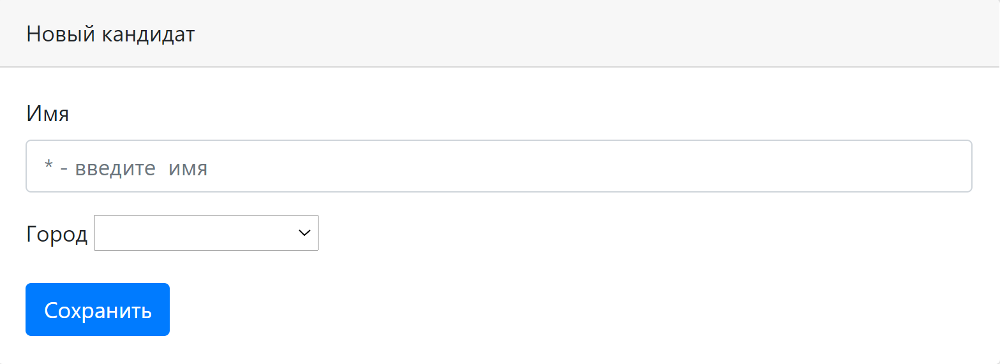

### Веб-приложение для поиска и добавления вакансий и кандидатов

Технологии:

Java Servlet API

Apache Tomcat

JDBC

PostgreSQL

JS (jQuery, AJAX), JSP, HTML

Junit, Mockito

Log4j, Sl4J 

Maven

Travis CI, CodeCov, CheckStyle

### Страница регистрации

### Страница авторизации

### Страница вакансий

### Страница добавление вакансии

### Страница кандидатов

### Страница добавление кандидата

